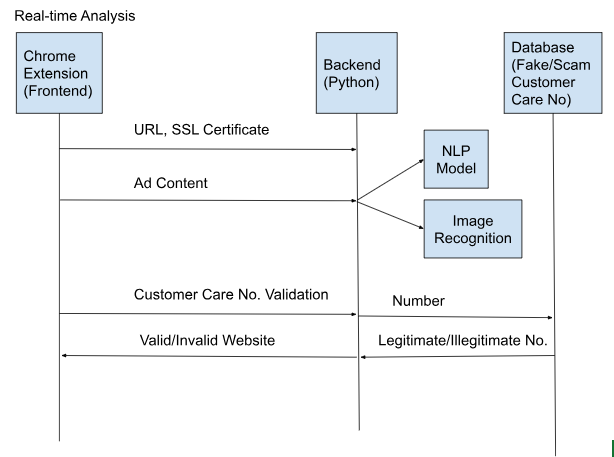
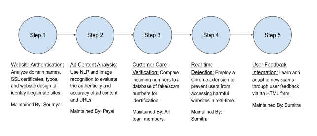

# RACCAM HACKATHON 1.0 - AI/ML System for Detecting and Mitigating Online Fraud

## Problem Statement

**Design a Automated AI/ML System for Detecting and Mitigating Online Fraud**

Creating and implementing an AI/ML-based system that can autonomously analyze and categorize online content, distinguishing between authentic and fake/fraudulent websites, advertisements, and customer care numbers.

## Solution

### 1. Website Authentications
Developing algorithms to assess the legitimacy of websites based on domain names, SSL certificates, typos, and poor website design.

### 2. Ad Content Analysis
Implementing NLP and image recognition techniques to analyze the extracted content and images present in the advertisement, along with the URL incorporated, to evaluate the authenticity and accuracy of the ad content.

### 3. Customer Care Number Verification
Establishing a database of fake/scam customer care numbers and comparing incoming numbers through REST API to identify potential scams.

### 4. Real-time Detection
Enabling real-time analysis of online content using a Chrome extension to prevent users from accessing fake or malicious websites.

### 5. User Feedback Integration
Incorporating an HTML form for user feedback to enhance the extension’s accuracy and adapt to evolving fraudulent tactics.

## Software and Technology

1. **Programming Languages:** HTML, CSS, JavaScript (Frontend), Python (Backend)
2. **Frameworks:** TensorFlow, PyTorch (Computer Vision), Flask (Python API)
3. **Libraries:** Numpy, Pandas, Scikit, SpaCy, NLTK (NLP), OpenCV (Computer Vision)

## Team Members & Responsibilities

- **Soumya Pandey:** Website Authentications
- **Payal Kaur:** Implementing NLP and Image Recognition for advertisement analysis
- **Sumitra Sharma:** Creating Chrome extension for real-time analysis

## Flow Chart / Graphical Representation

## Schedule

## Completed Tasks

1. **User Interface:**
   - Implemented a user interface for seamless interaction with the system.

2. **URL Analyzer Model:**
   - Developed a robust AI/ML model capable of analyzing URLs to detect and mitigate online fraud.

3. **Web Scraping:**
   - Implemented web scraping functionality to gather relevant data for analysis.

4. **Optical Character Recognition (OCR):**
   - Integrated OCR technology for extracting text content from images.

5. **NLP Model for Ad Content Analysis:**
   - Implemented a Natural Language Processing (NLP) model to analyze and categorize ad content.

## Remaining Tasks

1. **Integrating Database for Fake Customer Care Numbers:**
   - Planning to integrate a database system to cross-reference and identify fake customer care numbers.

2. **Updating User Interface for Feedback Integration:**
   - Enhancing the user interface to facilitate user feedback and improve system performance.
     
---

**Note:** This README provides an overview of the problem statement, proposed solution, technologies used, team members, and a placeholder for graphical representation and schedule. Feel free to customize it according to your specific project details.

